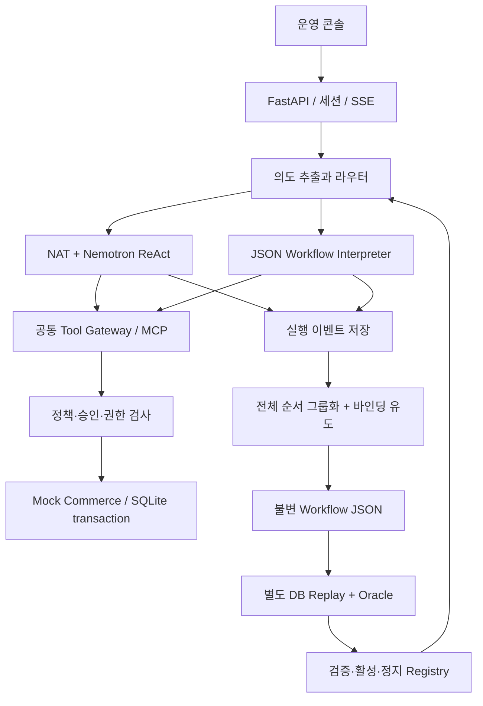
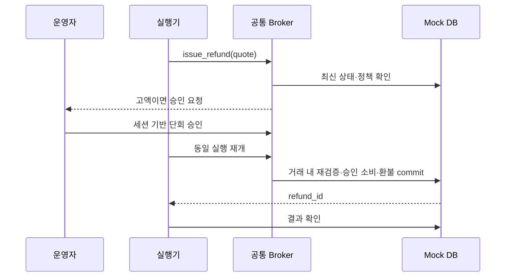

# SkillForge MVP 설계

## 1. 설계 결정

Python 3.12 + FastAPI/Pydantic + SQLite, React/TypeScript/Vite를 사용한다. 프런트는 운영 콘솔 하나, backend는 모듈을 나눈 단일 서비스로 시작한다. 실제 추론은 NVIDIA Build의 Nemotron 후보를 사용하고 NAT(NeMo Agent Toolkit)로 실행·평가를 연결한다. 정확한 버전과 플러그인은 T00에서 lock한다. MCP를 구현하더라도 별도 원격 시스템 여러 개를 만들지 않는다.

로컬 실행은 기본 개발 프로필, NemoClaw/OpenShell은 별도 검증 프로필이다. 애플리케이션 broker는 환불 업무 정책을, OpenShell은 파일·프로세스·네트워크 경계를 담당한다. 양자를 같은 “안전 보장”으로 묶지 않는다([R06/R07](../../../docs/06-references.md)).

## 2. 모듈과 신뢰 경계



격리 프로필에서는 Agent/Executor를 sandbox 내부에 두고 mock backend는 통제된 서비스 endpoint로만 접근한다. DB 직접 mount와 임의 shell 도구를 agent에 주지 않는다. 활성 워크플로·정책은 agent에게 읽기만 허용하고 수정은 운영 API가 담당한다. 데모 operator 인증은 localhost 전용 서버 세션으로 분리하며 모델에는 해당 세션·승인 endpoint를 제공하지 않는다. 외부 배포 시 별도 인증 설계가 필요하다.

## 3. 업무 흐름과 도구 계약

정상 경로: `get_order → get_return_status → get_refund_policy → quote_refund → issue_refund → verify_refund`.

| 도구 | 입력 | 결과 | 변경 여부 |
|---|---|---|---|
| get_order | order_id | owner/status/paid_krw/refunded_krw/version | read |
| get_return_status | order_id | received/status/version | read |
| get_refund_policy | order_id | policy_hash/approval_limit/eligibility | read |
| quote_refund | order_id | quote_id/amount_krw/order_version/policy_hash/expires_at | compute |
| issue_refund | order_id, quote_id, idempotency_key, approval_id? | refund_id/status/amount_krw | write |
| verify_refund | order_id | committed refund and expected state | read |

trusted customer_id/session/run_id는 서버 실행 컨텍스트에서 주입한다. 모델의 인자로 받지 않는다. quote_refund는 DB에서 금액을 계산하고 5분 유효 견적을 저장한다. issue_refund는 견적뿐 아니라 최신 상태와 소유권을 거래 안에서 다시 검사한다. LLM이 금액을 조작할 입력 경로를 없앤다.

정책: 반품 수령, 주문 소유, 전액 미환불, 유효 견적, 정책·주문 버전 일치가 필수다. 500,000원 이상은 추가 승인. 승인으로 필수 조건을 무시하지 못한다. 총액은 정수 KRW; 부동소수점 금액 금지.

## 4. 저장 모델

| 엔터티 | 필수 필드·제약 |
|---|---|
| orders | id, customer_id, paid_krw, refunded_krw, status, version |
| returns | order_id UNIQUE, received, version |
| policies | hash, version, approval_limit_krw, active |
| quotes | id, order_id, amount_krw, order_version, policy_hash, expires_at |
| refunds | id, order_id UNIQUE, idempotency_key UNIQUE, payload_hash, amount_krw, status |
| approvals | id, operator_id, order_id, amount_krw, order_version, policy_hash, expires_at, consumed_at |
| runs | id, mode, input_ref, model_config_hash, status, started_at, finished_at, oracle_result |
| events | run_id, seq UNIQUE per run, kind, redacted_payload, duration_ms |
| workflows | id/version, artifact_hash UNIQUE, state, source_trace_ids, policy_hash, tool_schema_hash |
| evaluations | id, workflow_hash, split_hash, config_hash, report_path, passed |

SQLite를 원본 저장소로 하고 JSONL은 export 포맷으로 쓴다. 두 저장소 동시 쓰기 실패를 만들지 않는다. 쓰기 거래는 BEGIN IMMEDIATE + unique 제약으로 직렬화하며 DB busy는 제한 재시도 후 명시적 실패다. mock backend 거래 안에서 승인 소비·환불 레코드·주문 금액 업데이트를 함께 commit한다.

idempotency key가 같고 payload가 같으면 최초 결과 반환, 같은 key에 다른 payload면 conflict. key가 달라도 order_id unique가 전액 이중 환불을 막는다. 이 설계는 로컬 DB 원자성 범위의 보장이다. 실제 결제 gateway의 exactly-once를 주장하지 않는다.

## 5. Trace와 인자 출처

이벤트: run.started, model.completed, tool.requested, policy.decided, tool.completed, run.completed. 모델 메시지 전문 대신 공개 tool call·최종 답변·usage·finish_reason과 redacted 도구 결과를 보존한다. 토큰 수 미제공은 null. run mode는 live/mock/replay를 별도 필드로 둔다.

각 argument에는 provenance를 부착한다. 예: order_id는 `input.order_id`, quote_id는 `steps.quote.quote_id`, idempotency_key는 `context.idempotency_key`. 과거 실제 ID와 금액을 템플릿 상수로 복사하지 않는다. 같은 값이 여러 출처에 있어 모호하면 등록된 도구 계약으로 확인하거나 후보를 거절한다.

## 6. 후보 유도와 컴파일

1. 독립 oracle로 성공 판정된 discovery 실행 중 표준 환불 버킷만 선택한다. 실패 trace는 원본에 보존한다.
2. task_type, policy_hash, tool_schema_hash로 나눈 뒤 **완전한 ordered tool sequence**가 동일한 기록을 묶는다. 반복 read 제거 등 의미 변경 최적화는 하지 않는다.
3. 같은 입력 재실행을 중복 support로 세지 않는다. 서로 다른 scenario/order 5개 이상 필요.
4. tool contract에서 각 step의 입력 타입/출력 타입을 확인하고 provenance를 공통 참조로 일반화한다. LLM은 후보 설명만 보조하고 실행 DSL을 자유 생성하지 않는다.
5. 필수 도구/전후조건, 참조 순서, 타입을 정적 검사한다. 지원하지 않는 경로는 이유와 함께 제외한다.

알고리즘은 범용 컴파일러가 아니라 **도메인 계약에 제한된 trace-to-workflow 컴파일러**다. 바인딩 규칙과 정책은 사람이 정의한다. 실제 순서와 후보의 source provenance는 실행에서 유도한다. 결과가 수동 workflow와 같아도 발견 과정과 증거는 보존한다.

DSL 예시(계약 설명용, 실행 결과 아님):

```json
{
  "id": "standard_refund", "version": 1,
  "input_schema": {"order_id": "string"},
  "policy_hash": "PIN_AT_BUILD", "tool_schema_hash": "PIN_AT_BUILD",
  "source_trace_ids": ["discovery-01", "discovery-02"],
  "preconditions": ["owned_order", "return_received", "not_refunded"],
  "steps": [
    {"id":"order","tool":"get_order","args":{"order_id":{"ref":"input.order_id"}}},
    {"id":"returned","tool":"get_return_status","args":{"order_id":{"ref":"input.order_id"}}},
    {"id":"policy","tool":"get_refund_policy","args":{"order_id":{"ref":"input.order_id"}}},
    {"id":"quote","tool":"quote_refund","args":{"order_id":{"ref":"input.order_id"}}},
    {"id":"refund","tool":"issue_refund","args":{"order_id":{"ref":"input.order_id"},"quote_id":{"ref":"steps.quote.quote_id"},"idempotency_key":{"ref":"context.idempotency_key"}}},
    {"id":"verify","tool":"verify_refund","args":{"order_id":{"ref":"input.order_id"}}}
  ],
  "postconditions": ["one_full_refund", "amount_matches_quote"]
}
```

예시 source ID는 간결하게 2개만 기재했으며 실제 승격에는 최소 5개가 필요하다. 상태·승인 컨텍스트는 실행기가 관리한다. DSL은 임의 표현식, template eval, shell, 네트워크 주소, loop를 허용하지 않는다. pre/postcondition은 등록된 enum 함수 이름만 허용한다.

## 7. 상태 전이와 실패 처리

Workflow: CANDIDATE → VERIFYING → VERIFIED → ACTIVE. 검증 실패는 REJECTED, 버전 변화는 STALE, 운영자 중지는 DISABLED. 수정은 새 버전 생성만 허용한다. VERIFIED와 ACTIVE 사이에는 운영자의 명시적 활성화가 있다.

Run: CREATED → RUNNING → SUCCEEDED / DENIED / AWAITING_APPROVAL / FAILED / NEEDS_RECONCILIATION. AWAITING_APPROVAL은 승인·재검증 후 RUNNING 또는 DENIED로 바뀐다. 승인 대기는 latency에서 별도 측정한다.



쓰기를 시도한 뒤 응답이 끊기면 같은 업무를 ReAct로 다시 시작하지 않는다. 저장된 execution ID/idempotency key로 조회하여 확정 결과를 확인한다. 미확정이면 NEEDS_RECONCILIATION을 유지한다. 승인으로 재개할 때 최신 quote를 다시 만들 필요가 있으면 금액·정책·주문 버전을 비교하고 달라진 승인은 폐기한다.

## 8. 라우팅

Nemotron 1회로 intent enum(refund/status/unsupported)과 order_id를 추출한다. status는 문의 안내만 제공하고 별도 최적화 업무로 확장하지 않는다. 입력 schema 불일치/모호성은 확인 요청. 서버가 ACTIVE 상태·정책·도구 hash를 검사한 후 workflow 또는 ReAct로 보낸다. 모델 self-confidence를 안전 판단으로 쓰지 않는다. 응답 요약은 선택적 모델 1회 또는 명시적 템플릿; 모든 비교군에서 동일 방식을 쓴다.

## 9. API 계약 초안

| Endpoint | 목적 / 주요 응답 |
|---|---|
| POST /api/runs | text, scenario_id, requested_mode → 202 run_id |
| GET /api/runs/{id} | state, outcome, metrics, failure_reason |
| GET /api/runs/{id}/events | SSE event_id/seq; 재접속 시 last event부터 |
| POST /api/candidates | discovery_dataset_id → candidate IDs |
| POST /api/workflows/{id}/verify | validation_split_id → evaluation_id |
| POST /api/workflows/{id}/activate | operator session + expected_hash → ACTIVE |
| POST /api/approvals/{id}/decision | approve/deny + bound payload version |
| GET /api/evaluations/{id} | A/B/C summary + run references |

POST는 중복 클릭을 방지하는 request key를 받는다. schema 오류 422, 권한 403, 상태 충돌 409, 의존 API 장애 503. 업무상 환불 거절은 run outcome=DENIED로 구분한다. 데모 초기화 endpoint는 로컬 모드에서만 제공하고 활성 run이 있으면 차단한다.

## 10. 검증과 운영

유닛: 바인딩·DSL·정책·승격. 통합: MCP 공통 경로·NAT trace·DB 거래·승인 후 재검증. 상태 기반/속성 테스트: 임의 반복 요청에도 누적 환불≤결제액, 승인 없는 고액 환불 없음. E2E: 정상→후보→활성→재사용, 중복 차단, 정책 변경. 평가 데이터와 지표는 docs/03-evaluation.md에 단일 정의한다.

로그와 UI에서 모델/버전/hash/run ID를 추적한다. 격리 실험은 실제 차단 로그가 있어야 통과한다. mock 테스트가 통과해도 live 통합·실성능 완료로 표시하지 않는다.


## 2026-09-26 구현 보강: 출처 컴파일과 정책 실험

`compiler.derive_steps`는 실제 requested/completed 이벤트를 순서대로 읽어 typed symbol table을 구성한다. 주문 입력, 이전 완료 quote 출력, trusted 실행 컨텍스트만 허용한다. provenance 주장과 실제 값·타입·시간 순서가 일치해야 한다. 서버 idempotency key는 trace에서 마스킹되므로 문자열을 복원하지 않고 서버 run context로 재생성한다. 최종 oracle가 없는 구형 trace는 자동 편입하지 않는다.

정규화한 단계 JSON 해시와 source mode로 버킷을 묶고 서로 다른 주문 5건을 요구한다. 후보의 steps는 관측 기록에서 구성한다. `manual_workflow`를 호출하지 않는다. 지원 도구 순서는 여전히 환불 도메인의 6단계 한 종류다. 범용 프로그램 합성이나 DAG 학습이 아니다.

`PolicyLab`은 validation 30개 + 이전·새 기준 경계 12개를 각각 격리 SQLite에서 실행한다. 42쌍은 산업 대표 표본이 아니며 경계군 사이 일부 금액이 반복된다. 예상 판정은 fixture와 정책 임계값에서 계산하며 실제 결과를 정답으로 쓰지 않는다. 전체 이전 절차를 무효화하는 보수적 전략을 사용한다.

`policy_reviews`에 보고서를 보존하고 적용 시 base policy hash를 compare-and-swap한다. 새 후보는 parent_artifact_hash/origin_policy_hash를 보존한다. 이것은 기존 도구 절차의 재검증이지 새 정책에서 모델이 학습한 기록이라는 주장이 아니다. 검증 중 정책 변경은 마지막 거래에서 거절한다. 구형 승인도 정책 hash binding 때문에 새 정책에 사용할 수 없다.
