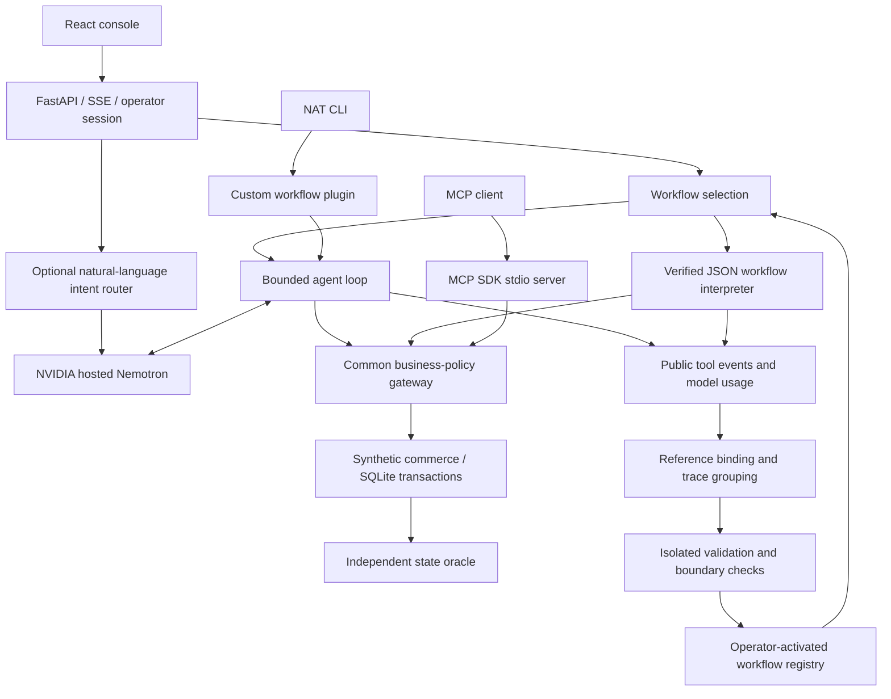

# NVIDIA integration: architecture and evidence

## 실제 실행 경로



웹 콘솔의 기본 에이전트 경로는 자체 bounded loop다. NAT는 이 loop를 custom workflow로 실행하는 별도 진입점이며 NAT 기본 ReAct 구현을 사용했다는 의미가 아니다. MCP는 동일 gateway를 외부 client에 제공하는 별도 진입점이다. 모든 웹·NAT 요청이 MCP 통신을 거치는 것은 아니다.

## NVIDIA가 담당하는 동작

| 구성 | 실제 역할 | 구현 |
|---|---|---|
| NVIDIA hosted Nemotron | 사용자 요청에서 도구 호출을 생성하고 이전 도구 결과를 받아 다음 호출 결정 | backend/engine.py: NVIDIAClient / execute |
| Nemotron natural-language router | Live 자연어 입력의 intent·order 추출; 모호한 주문은 실행 전 확인 요청 | backend/router.py |
| NeMo Agent Toolkit 1.9.0 | custom workflow 등록·실행, root/tool span 연결 | backend/nat_plugin.py, configs/nat-live.yml |
| MCP SDK 2.2.0 | gateway의 환불 도구 6개를 stdio로 제공 | backend/mcp_server.py |
| 자체 검증·재사용 계층 | 출처 바인딩, 독립 검증, 활성화, 정책 영향 비교와 재검증 | backend/compiler.py, engine.py, governance.py |

모델은 `nvidia/nemotron-3-super-120b-a12b`, endpoint는 NVIDIA hosted Chat Completions다. 모델 응답은 권한이 아니다. 서버는 도구 allowlist·현재 주문 scope·정책·승인 binding을 검사한다. 12턴/총 90초 예산과 제한적 일시 오류 재시도를 적용하며 live 실패를 mock 성공으로 바꾸지 않는다.

## 재현 가능한 증거

| 원본 | 확인할 내용 | 범위 |
|---|---|---|
| [신규 정책 실험](../artifacts/policy-change-evidence.json) | source=새 NVIDIA discovery, 5개 성공 출처, model.completed·tool.requested, DB oracle, policy comparison | 신규 source는 live, 42쌍 비교는 synthetic executor replay |
| [별도 재실행](../artifacts/policy-change-live-retry.json) | HTTP 500 최초 실패 후 새로운 격리 주문의 성공 실행 | 최초 실패는 이전 파일에 보존 |
| [NAT live](../artifacts/nat-live-evidence.json) | custom workflow 실제 모델 실행 결과 | 이전에 수집한 live 통합 증거 |
| [NAT span](../artifacts/nat-span-evidence.json) | root/tool start/end 연결 | mock 실행의 tracing 증거, live span이라고 부르지 않음 |
| [MCP](../artifacts/mcp-evidence.json) | stdio client/server 통신과 도구 호출 | synthetic DB, 실제 프로토콜 검증 |
| [검증 보고서](reviews/policy-change-release.md) | 회귀 57건, 안전 행렬 36건, UI·별도 설치 검증 및 한계 | 각 분모와 검증 시점을 구분 |

`policy-change-evidence.json`의 최상위 passed=false는 최초 live 비교의 HTTP 500을 포함한 결과다. 정책 비교·workflow 재검증은 통과했고 별도 재실행도 성공했지만 최초 실패를 삭제하지 않았다. NAT/MCP 통합 증거와 신규 정책 실험은 서로 다른 실행이며 하나의 end-to-end run이라고 합치지 않는다.

## 실행 명령

README 설치 후 로컬 환경에 본인의 NVIDIA_API_KEY를 설정한다. 키를 명령행·스크린샷·Git에 넣지 않는다.

```bash
# 최신 코드로 신규 모델 discovery + 정책 전후 비교 (실제 API 사용)
PYTHONPATH=. .runtime/bin/python scripts/policy_change_demo.py --collect-live --live
# 별도 NAT 진입점; 기본 seed의 order-001이 이미 환불됐다면 별도 DB 사용
SKILLFORGE_DB=:memory: .runtime/bin/nat run --config_file configs/nat-live.yml --input order-001
# MCP 프로토콜 검사
.runtime/bin/python tests/mcp_smoke.py
```

NemoClaw/OpenShell OS 격리는 구현·검증 범위에 포함하지 않았다. 서버의 업무 정책 검사를 OS sandbox라고 표시하지 않는다. SQLite의 원자성·중복 방지는 합성 업무 DB 범위이며 실제 결제나 분산 서비스의 exactly-once 보장이 아니다.
